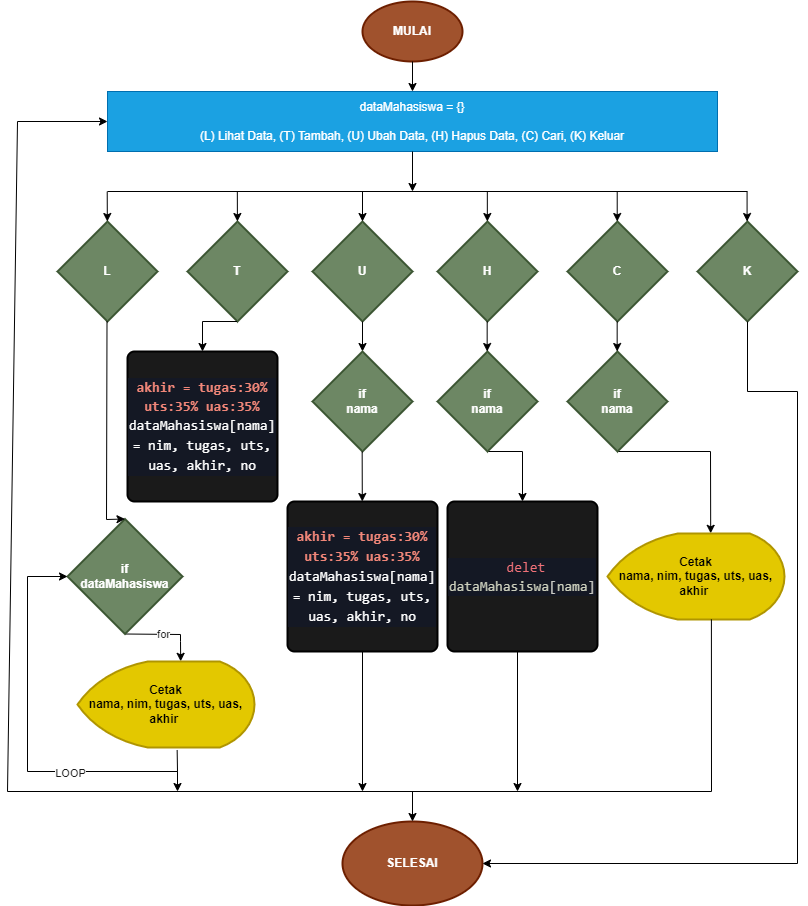

# **PROGRAM INPUT NILAI MAHASISWA MENGGUNAKAN DICTIONARY**

[](https://www.instagram.com/rezastein_) [](https://www.instagram.com/rezastein_) [](https://www.instagram.com/rezastein_)

### **MY SOSIAL MEDIA :**

[](https://www.instagram.com/rezastein_) <br> [](https://www.facebook.com/rezastein.rezastein) <br> [](https://twitter.com/rezastein_) <br> [](https://wa.me/qr/UK5NMG54XWHJC1)

## **Deskripsi**

1. Deklarasi dictionary dengan nama _dataMahasiswa_ untuk menampung semua data/element, dan _no_ di isi dengan angka 0 agar nanti ketika di tampilkan variable _no_ ini akan di panggil untuk mengisi angka angka data.
2. gunakan _while True_ sebagai looping dan di isi dengan input _data_ untuk menampung semua statmen.
3. gunakan statment **if** di isi dengan string "t" untuk masuk kestatment penambahan data dan di isi input _(nama,nim,tugas,uas,uts)_ serta tambahkan juga variable _akhir_ yang di isi dengan perhitungan **(tugas:30% uts:35% uas:35%)** contoh:

```sh
akhir = (tugas / 3) + (uts / 3.5) + (uas / 3.5)
```

- setelah itu tambahkan semua element ke dictionary.
  <br>

4. selanjutnya gunakan statment _elif_ untuk melanjutkan statment _if_
   dan di isi dengan string "u" untuk masuk ke statment ubah data di isi dengan inputan _nama_ dan gunakan statment _if nama di dalam dataMahasiswa_ untuk menjelaskan bahwa yang mau di ubah adalah nama yang di inputkan, selanjutnya di dalam statment _if nama di dalam dataMahasiswa_ berisikan inputan _(nim, tugas, uts, uas)_ dan variable _akhir_ yang di isi dengan perhitungan **(tugas:30% uts:35% uas:35%)** sperti contoh di atas, selanjutnya ubah element _(nim, tugas, uts, uas)_ contoh :

```sh
dataMahasiswa[nama] = nim, tugas, uts, uas, akhir
```


- untuk statment _else_ di isikan cetak **"DATA TIDAK DI TEMUKAN!"**
  <br>

5. selanjutnya gunakan statement _elif_ lagi di isi dengan string "h" untuk masuk ke statement hapus data di isi dengan input _nama_ dan gunakan statment _if nama di dalam dataMahasiswa_ di isi dengan syntax _del_ untuk menghapus data _nama_ yang ada di dalam _dataMahasiswa_, selanjutnya _else_ jika statment inputan tidak ada di dalam data dan cetak **"DATA TIDAK DI TEMUKAN!"**
6. selanjutnya gunakan statement _elif_ lagi di isi dengan string "l" untuk masuk ke statement lihat data di isi dengan statment _if nama di dalam dataMahasiswa.items_ untuk menampilakn seluruh isi element di isi dengan cetak _dataMahasiswa_ dan gunakan _for tampil di dalam dataMahasiswa_ agar melooping jika data lebih dari satu, increment juga _no += 1_ dan cetak semua element, contoh:

```sh
print("| {6:2} |\t {0:15}   | {1:9} \t| {2:5} | {3:3} | {4:3} | {5:5} |".format(tampil[0], tampil[1][0], tampil[1][1],tampil[1][2], tampil[1][3],
"%.2f" % float(tampil[1][4]), no))
```

- untuk statment _else_ di isikan cetak **"TIDAK ADA DATA"**
  <br>

7. selanjutnya gunakan statement _elif_ lagi di isi dengan string "c" untuk masuk ke statement cari data dan gunakan statment _if nama di dalam dataMahasiswa.keys_ untuk mengakses element pada *dataMahasiswa*.
untuk statment _else_ di isikan cetak **"TIDAK ADA DATA"**
8. selanjutnya gunakan statement _elif_ lagi di isi dengan string "k" untuk keluar di isi dengan syntax *exit( )*
9. untuk *else* pada statment if yang pertama di isikan dengan cetak "PILIHAN MENU TIDAK ADA!:
10. TERIMA KASIH
## **Flowchart**

